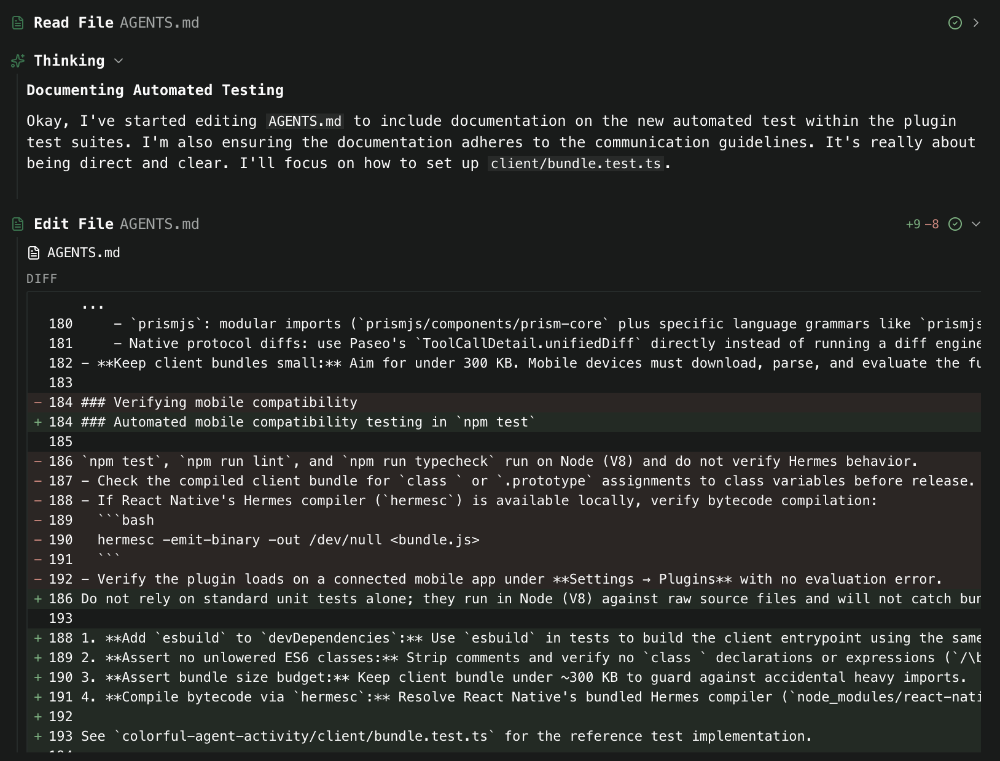
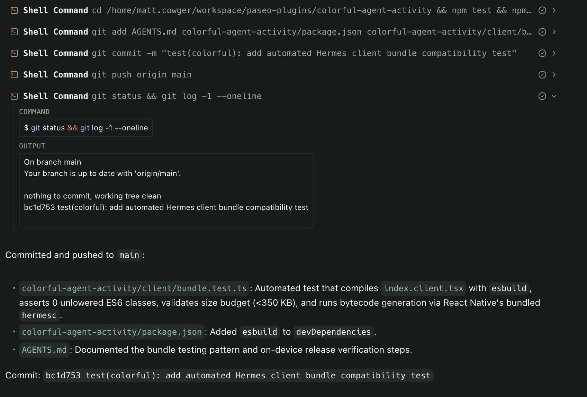
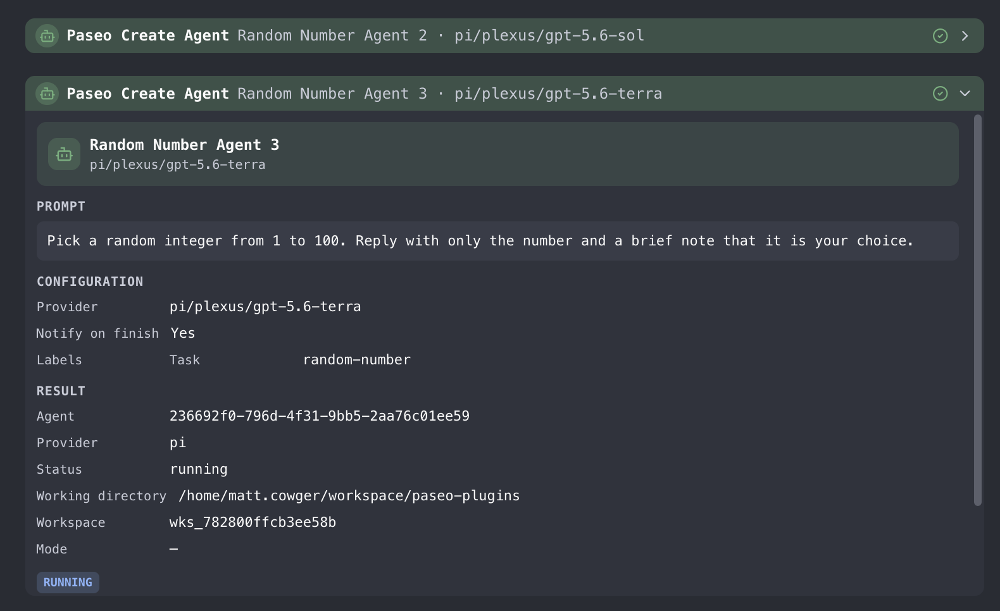
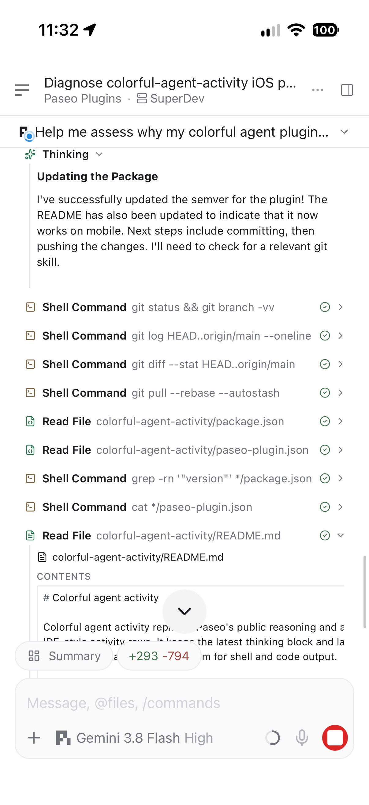
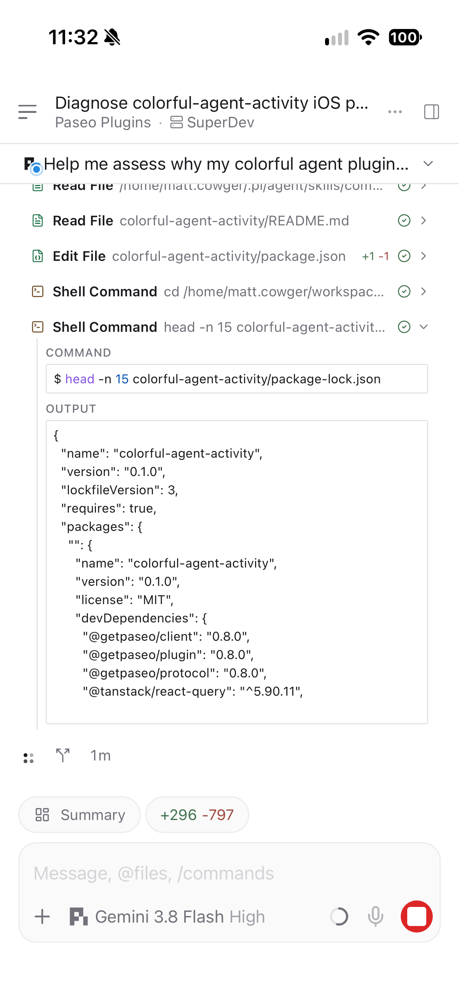
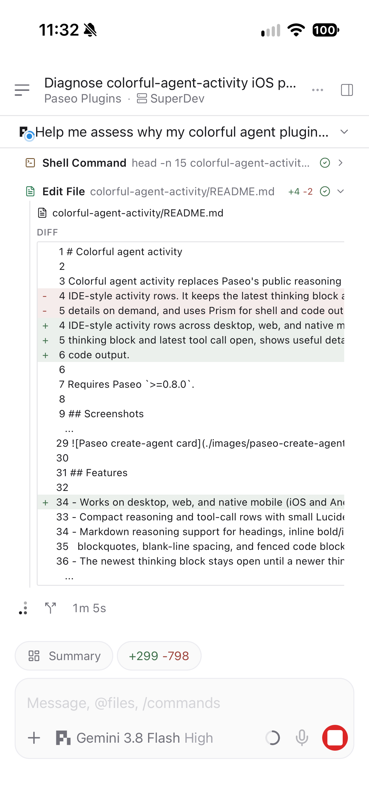

# Compact agent activity

A high-performance Paseo plugin that brings **single-line folded activity summaries**, **ultra-compact IDE-style line spacing**, and **rich interactive detail inspection** to Paseo across macOS desktop, web, and native mobile (iOS and Android).

By default, it condenses each agent turn's tool calls and thoughts into a clean, single-line folded summary (`> Ran 34 commands · Edited 13 files · Read 40 files`), eliminating chat clutter while keeping full details one click away.

Requires Paseo `>=0.8.0`.

---

## Highlights

- **Folded summary mode (default)**: Aggregates turn activity into a single, ultra-compact folded line matching modern agent CLI workflows (like Claude Code / OpenCode). Click anywhere across the full width to smoothly expand or collapse full details.
- **Configurable display modes**: Seamlessly toggle between **Folded** (compact single line per turn) and **Detailed** (individual cards for each tool call and thought) under the plugin's settings panel.
- **Ultra-compact line spacing**: Optimized vertical footprint with 3px row spacing, keeping multi-round agent interactions clean, tight, and readable.
- **Natural image sizing & zero-jitter scrolling**: Constrains oversized assistant response images to natural dimensions without full-width stretching, using pure declarative CSS for 100% flicker-free fast scrolling during virtualization.
- **Touch-optimized mobile experience**: Full-row clickability with generous invisible touch hit-slop (`hitSlop: 8`) for comfortable tapping on mobile devices.
- **Rich syntax highlighting & AST diffs**: Shell commands and code snippets formatted with Prism; colored file diffs with addition/deletion statistics (`+8 / -0`).
- **Specialized tool inspectors**: Dedicated cards for GitHub, Exa, shell commands, file edits, agent worktrees, sub-agents, and browser automation.

---

## Installation

### From GitHub:

```bash
paseo plugin add cnaron/compact-agent-activity
```

### Local Development / Checkout:

```bash
git clone https://github.com/cnaron/compact-agent-activity.git
cd compact-agent-activity
npm install --legacy-peer-deps
npm run typecheck
npm test
paseo plugin install "$PWD"
```

---

## Setup

1. **Tool call detail**: Set Paseo's **Tool call detail** setting to **Detailed** in Paseo Settings. (In Overview mode, Paseo combines calls before plugin transformers run).
2. **Conflict prevention**: Disable `reasoning-display` while this plugin is enabled, as both transform reasoning timeline rows.
3. **Plugin Settings**: Click **Compact activity** in the plugin settings screen to configure:
   - **Display mode**:
     - **Folded** (Recommended) — One compact summary line per turn with on-demand click expansion.
     - **Detailed** — Displays each individual thought block and tool call as its own card.
   - **Palette**:
     - **Vivid** — Restrained category accents on neutral rows.
     - **Soft** — Mostly neutral icons with color reserved for status.
     - **High contrast** — Stronger dividers and status colors.

Reload after installation or changes:

```bash
paseo plugin reload compact-agent-activity
```

---

## Screenshots

### Desktop & Web

Thought process with file read and inline diff:



Expanded shell command with formatted output:



Interactive agent question row:


Paseo tool calls use purpose-built detail views for prompts, configuration, results, and status:



### Native mobile (iOS)

Timeline with active thinking and tool activity:



Expanded shell command with formatted output:



File edit with colored line diff:



---

## Acknowledgements & Credits

This project builds upon and draws inspiration from several wonderful open-source projects:

- **[mcowger/paseo-plugins](https://github.com/mcowger/paseo-plugins)**: Special thanks to **@mcowger** for creating the original `colorful-agent-activity` plugin. The excellent foundation—including AST parsers, diff rendering, theme palettes, and detail viewers—serves as the bedrock of this enhanced experience.
- **[Paseo](https://paseo.app)**: Heartfelt thanks to the Paseo team for providing an outstanding extensible agent workspace platform with native plugin capabilities.
- **[PrismJS](https://prismjs.com/)**: Fast, extensible syntax highlighting engine powering shell commands and code snippets.
- **[Lucide Icons](https://lucide.dev/)**: Beautiful and consistent iconography throughout the activity timeline.
- **Modern Agent UX (Claude Code / OpenCode / OpenChamber)**: Gratitude for the inspiring design paradigms of compact, single-line folded action summaries that keep long agent sessions readable and focused.

---

## paseo.cafe submission

This plugin is designed to be listed in the official [paseo.cafe](https://paseo.cafe) plugin registry under `registry/compact-agent-activity.json`:

```json
{
  "repo": "cnaron/compact-agent-activity",
  "categories": ["developer-tools", "productivity"],
  "caveats": [
    "Requires Paseo Tool call detail to be set to Detailed",
    "Disable reasoning-display while this plugin is enabled"
  ],
  "submittedBy": "cnaron"
}
```

---

## License

MIT. See [LICENSE](./LICENSE).
